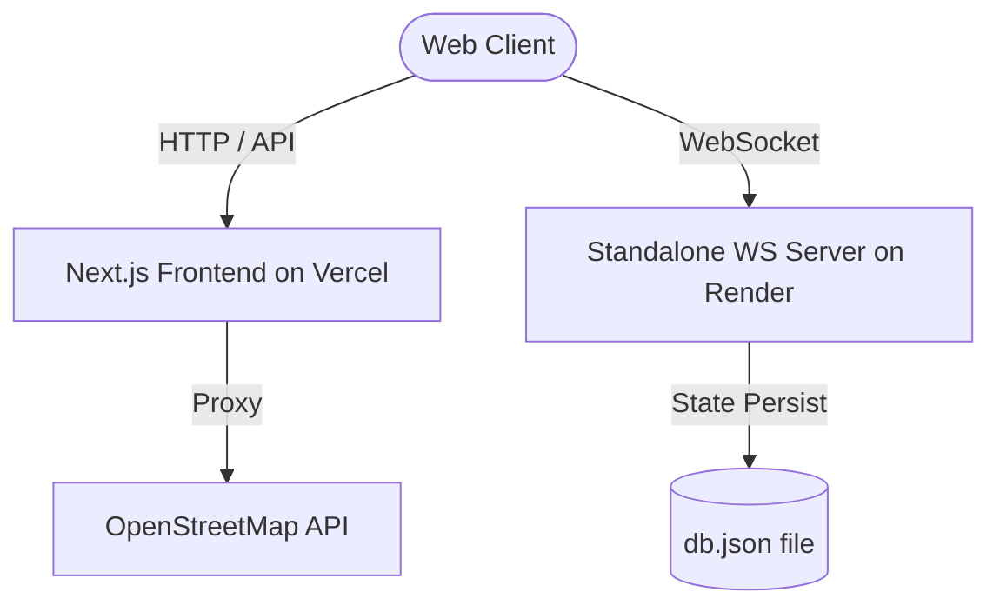

# 🏙️ FOROOMS: Participatory Urban Planning in Multiplayer 3D

[](https://nextjs.org)
[](https://threejs.org)
[](#)
[](#)

**FOROOMS** is a lightweight, participatory **Digital Twin** platform designed to fit into contemporary urban planning and design frameworks. By bridging the gap between high-fidelity GIS data and democratic citizen engagement, FOROOMS allows citizens, architects, and municipal planners to reconstruct real-world city structures from OpenStreetMap (OSM) in a responsive 3D WebGL environment, place annotations, run design simulations, and collaborate on spatial updates in real-time.

---

## 🎨 Key Features

* 🌐 **Geo-Spatial Digital Twin**: Instantly generates 3D voxel representations of real-world urban environments using OpenStreetMap (OSM) building footprints, heights, and road vectors.
* 👥 **Collaborative Parametric Urbanism**: Real-time multiplayer synchronization, allowing participants to co-design and modify building heights, colors, and textures instantly in a shared sandbox.
* 💬 **Geo-Anchored Forums**: Place markers (pins) directly onto base coordinates to start comment threads—acting as localized public forums for site-specific urban issues (markers dynamically scale by reply density).
* 🗺️ **High-Visibility Satellite MiniMap**: A real-time 2D tracking system styled with Esri World Imagery tiles to align the 3D digital twin with actual geographical contexts.
* 🏢 **Procedural Urban Facades**: Simulates organic architectural variance by deterministically assigning Concrete Panel, Brick, or Glass Curtain Wall facades based on grid coordinates.
* 🌥️ **Atmospheric & Visual Scenery**: Metaball-based procedural cloud clusters, fog blending, and custom wave textures to create an immersive, gamified spatial simulation.

---

## 🏗️ System Architecture



---

## 📂 Codebase Tour

```
├── party/                  # Original PartyKit backend code (optional)
├── scripts/                # Utility and deployment scripts
│   ├── server.js           # Production standalone WebSocket server
│   └── DEPLOYMENT.md       # Step-by-step free hosting guide
├── src/
│   ├── app/                # Next.js pages & API routes (/api/osm)
│   ├── components/
│   │   └── voxel/          # Core WebGL client, Player, and Modals
│   ├── contexts/           # Authentication & role states
│   └── lib/
│       ├── blocks/         # Facades & Voxel type registries
│       ├── osm/            # OpenStreetMap parser & parser helper
│       └── voxel/          # Greedy meshing optimization & algorithms
├── party.toml              # PartyKit configuration
└── package.json            # Project entry & build configuration
```

---

## ⚡ Quick Start

### 1. Local Development

Start both the frontend and backend locally to test:

#### Terminal 1: Realtime WebSocket Backend
```bash
npm run start:server
```
Runs the standalone WebSocket server on `localhost:1999` with local file persistence.

#### Terminal 2: Next.js Frontend
```bash
npm run dev
```
Open [http://localhost:3000](http://localhost:3000) to view the client.

---

## 🚀 Elegant Git & Deployment Pipelines

FOROOMS is designed to leverage **Git-integrated CD (Continuous Deployment)**, which automates deploys without the complexity of manual CI workflows:

* 🌐 **Frontend (Next.js)**: Host on **Vercel**. By linking your GitHub repository, Vercel automatically deploys preview builds for your branches, and deploys to production whenever you merge to `main`/`master`.
* 🔌 **Backend (WebSockets)**: Host on **Render.com** (Free tier). Linking your GitHub repository to Render triggers an automatic deployment of the standalone server (`scripts/server.js`) on every push.

For complete, click-by-click instructions on setting up your free production server, see the [Render Deployment Guide](file:///c:/Users/treed/OneDrive/Desktop/FOROOMS/scripts/DEPLOYMENT.md).

---

## ⚙️ Technical Highlights

### 1. Greedy Meshing Optimization
Rather than rendering thousands of individual cubes (which degrades WebGL performance), the meshing algorithm in `mesher.ts` groups adjacent blocks of the same material into large unified cuboids. This reduces the draw-call count by up to **90%**, keeping rendering speeds smooth even on low-end mobile devices.

### 2. Sea & Island Isolation bounds
The grid calculates `islandBounds` based on OSM coordinates to render a solid grass foundation inside the boundary at `y = -0.49`, while rendering an infinite repeating matte water plane at `y = -0.5` outside the boundary, preventing the sea from clipping into underground structures.
