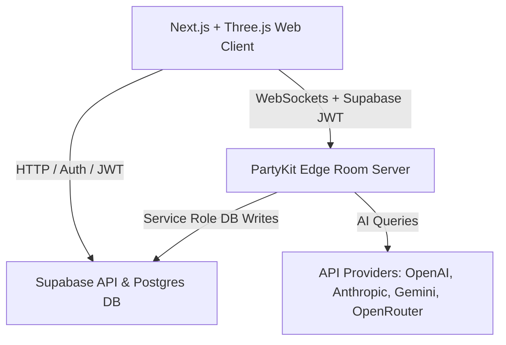

# FOROOMS: AAA Implementation Plan (v1.4.0)

This document outlines the final, refined theoretical, algorithmic, and engineering plan to develop **FOROOMS** (Urban Metaverse for Participatory Planning) as a Living Digital Twin web application, incorporating high-performance state checkpointing, OSM caching, advanced rendering standards, and a world-class academic repository layout.

---

## 1. Project Vision & Theoretical Foundations
To elevate FOROOMS as a world-class open-source project that serves as a legitimate tool for global civic planning, we ground the features in established urban and democratic theory:
*   **Communicative Action Theory (Habermas)**: The **Council Layer** serves as an egalitarian discourse space where all viewpoints are structured, not averaged or erased.
*   **Ladder of Citizen Participation (Arnstein)**: User roles map to ascending agency: *Citizen* (view/explore) $\rightarrow$ *Participant* (comment/vote) $\rightarrow$ *Builder* (construct/edit space) $\rightarrow$ *Admin* (configure/moderate). A visible proposal status system prevents "tokenism."
*   **Tactical Urbanism**: The **Playground Layer** allows low-cost, short-term voxel interventions to test ideas rapidly.
*   **Space Syntax (Hillier)**: Space connectivity and sightline analysis are used to calculate the legibility of user-generated designs.

---

## 2. Technical Stack & Deployment Architecture
A split-stack architecture isolates real-time game loops from stateless web application flows:

*   **Frontend (Vercel)**: Next.js + TypeScript + TailwindCSS + React Three Fiber (R3F) + MapLibre GL JS.
    *   **Map vs. 3D Transition**: The 2D MapLibre context (exploration) and the 3D Three.js context (in-Foroom) are separated. Moving from 2D to 3D triggers a coordinated CSS crossfade and camera dive to maintain immersion without rendering conflicts.
*   **Multiplayer Server (PartyKit)**: Runs stateful WebSockets at the edge. Authenticates users by verifying the passed Supabase JWT. Writes to Postgres using a secured Supabase Service Role key.
*   **Database & Auth (Supabase)**: Postgres storing profiles, metadata, chat logs, and the append-only block edit ledgers.
*   **AI Providers**: Dynamically dispatched to host-supplied API keys (stored securely in Supabase).

---

## 3. Data Optimization & Voxel State
To maintain a strict "least data" footprint:
1.  **Foroom Base**: Stored as a bounding box and a deterministic OSM snapshot date. Enforces a hard bounding-box limit of $2 \times 2$ km via UI and database checks.
2.  **Edit Log Ledger (`foroom_edits`)**:
    *   Columns: `foroom_id`, `layer` (council/playground/simulation), `user_id`, `action`, `coord` (x,y,z), `value`, `uuid`, `timestamp`.
3.  **State Checkpointing & Log Compaction**:
    *   To prevent loading delays in highly edited worlds, the PartyKit server compacts the log every 500 edits, saving a compressed snapshot blob to a `foroom_snapshots` table.
    *   On load, PartyKit reads the latest snapshot and replays only the edits written *after* the snapshot's timestamp.
4.  **Run-Length Encoding (RLE) Binary Format**: Active voxel chunks ($32 \times 32 \times 32$) are serialized as flat `Uint16Array` objects where adjacent pairs represent `[count, blockId]`.
5.  **Networking Payload**: Ephemeral movement updates (20Hz) are broadcast without DB writes. Voxel edits are broadcast immediately and persisted asynchronously by PartyKit.

---

## 4. Geospatial OSM-to-Voxel Pipeline with DEM Terrain
1.  **Ingestion Caching**:
    *   Raw Overpass API responses are stored in an `osm_cache` table keyed by a geohash of the bounding box coordinates. This prevents Overpass rate limits and ensures ingestion resilience.
2.  **Coordinate Projection & Elevation Mapping**:
    *   Translate Lat/Lng ($\phi, \lambda$) to Cartesian meters ($x, z$).
    *   **DEM Source**: Mapbox Terrain-RGB tiles are fetched. If unavailable, falls back to a flat plane $y=0$.
        $$y_{terrain} = \lfloor \text{DEM}(\phi, \lambda) \cdot S \rfloor$$
3.  **Rasterization & Extrusion**:
    *   **Base Terrain**: Voxels up to $y_{terrain}$ are solid terrain blocks.
    *   **Roads**: Projected flat on the local terrain elevation surface ($y_{terrain}$) with a $0.25$m extruded sidewalk.
    *   **Buildings**: Footprints are rasterized via raycasting. Buildings extrude starting from the **lowest terrain point** beneath their footprint up to the calculated roof height, preventing floating geometry on sloped hills.

---

## 5. Rendering & Aesthetics
*   **Instanced Rendering**: Group identical voxel types into `THREE.InstancedMesh`.
*   **Greedy Meshing & Face Culling**: Culls interior faces and merges same-texture adjacent faces.
*   **Voxel Material Aesthetics & Shimmer Prevention**:
    *   Replaces generic high-contrast pixel art with flat-shaded materials using a subtle procedural noise shader (baked into vertex colors) and beveled edges.
    *   Configures mipmapping on the texture atlas (`generateMipmaps = true`, using a `LinearMipmapLinearFilter` minification filter) to eliminate far-distance shimmering.
*   **Baked Vertex Ambient Occlusion (AO)**: Calculates corner shadowing accounting for terrain slopes and building edges.
*   **Activity Heatmap (Bloom)**: Active blocks glow based on interaction density via `UnrealBloomPass`.
*   **Custom Avatars**: Seeded-random spherical-head/polygonal-body shapes using a curated civic color palette.

---

## 6. The Three Layer Realities
*   **Council Layer ($L_{council}$)**: Base twin with terrain. Users place notes/polls inside blocks. Only Builders and Admins can modify voxel geometry. Glowing heatmap highlights high-activity areas.
*   **Playground Layer ($L_{playground}$)**: Collaborative sandbox. Every participant has a block placement quota and receives a uniquely textured block. Space modifications are saved as delta diffs and applied over the sloped terrain.
*   **Simulation Layer ($L_{sim}$)**: Bounded simulation governed by Cellular Automata (CA) rules (e.g., Flood dynamics flowing down elevation valleys and traffic particle meshes running along road indices).
    *   The AI Protector triggers these events and narrates simulation states, rather than arbitrarily editing individual blocks.

---

## 7. AI Protector & Simulation Governor
*   **Execution Strategy**: The AI Protector runs server-side (as a Supabase Edge Function or Vercel cron). It assumes a "System Builder" identity and writes state changes directly to the `foroom_edits` ledger, rather than mimicking a WebSocket client.
*   **Dynamic Provider Broker**: Supports direct integration with OpenAI, Anthropic, Gemini, and OpenRouter via admin-configured keys.
*   **Deliberative Moderation**: Synthesizes consensus from chat logs and notes using the "Habermas Machine" pattern, generating reports that represent both majority opinions and preserved minority viewpoints.

---

## 8. Mobile UX & Verification Plan
*   **Touch Gestures & Mobile Camera UX**:
    *   *Left Half:* A virtual joystick overlay drives player movement (WASD translations).
    *   *Right Half:* Drag gestures rotate the camera pitch and yaw.
    *   *Interaction:* Double-tap a block to place a note. Tap a selected block in Playground mode to modify blocks.
*   **Automated Tests**:
    *   Verify Cartesian projection and DEM offset logic via unit tests.
    *   Test RLE compression functions for lossless data transmission.
*   **Manual Verification**:
    *   Test multi-user synchronization and floating building foundations over mock elevation data.

---

## 9. World-Class Open-Source GitHub Repository & Academic Signature
To project FOROOMS as a leading-edge open-source contribution to the urban planning community, we will curate the repository structure and primary documentation at the conclusion of the build phase:
*   **Academic Signature**: The repository, visual diagrams, and academic abstract will be explicitly signed:
    > **Signed & Curated by:**
    > **PhD Poturak Semir, Institute for Applied Design Intelligence**
*   **Visually Rich `README.md`**:
    *   Incorporate high-quality architecture diagrams, vector icons, animated SVG flowcharts, and embedded walkthrough GIFs illustrating the 2D-to-3D transition and the Playground sandbox layers.
*   **Theoretical & Technical Grounding**:
    *   Detail the mapping of Arnstein's Ladder onto database roles and Habermas's communicative action models onto the AI Protector's consensus algorithms.
    *   Provide full coordinate projection mathematics and chunk RLE structure documentation directly in the codebase reference.
