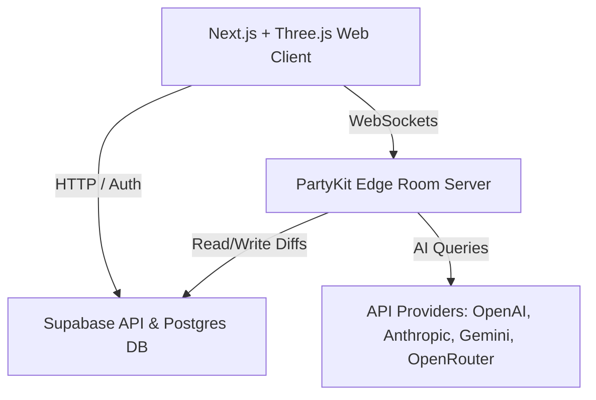

# FOROOMS: Upgraded Implementation Plan (v1.1.0)

This document outlines the theoretical, algorithmic, and engineering plan to develop **FOROOMS** (Urban Metaverse for Participatory Planning) as a Living Digital Twin web application with integrated terrain and multi-provider AI support.

---

## 1. Project Vision & Theoretical Foundations
To elevate FOROOMS as a world-class open-source project that serves as a legitimate tool for global civic planning, we ground the features in established urban and democratic theory:
*   **Communicative Action Theory (Habermas)**: The **Council Layer** serves as an egalitarian discourse space where all viewpoints are structured, not averaged or erased.
*   **Ladder of Citizen Participation (Arnstein)**: User roles map to ascending agency: *Citizen* (view/explore) $\rightarrow$ *Participant* (comment/vote) $\rightarrow$ *Builder* (construct/edit space) $\rightarrow$ *Admin* (configure/moderate). A visible proposal status system prevents "tokenism."
*   **Tactical Urbanism**: The **Playground Layer** allows low-cost, short-term voxel interventions to test ideas rapidly.
*   **Space Syntax (Hillier)**: Space connectivity and sightline analysis are used to calculate the legibility of user-generated designs.

---

## 2. Technical Stack & Deployment Architecture
A split-stack architecture isolates real-time game loops from stateless web application flows, avoiding Vercel serverless WebSocket limitations:

*   **Frontend (Vercel)**: Next.js + TypeScript + TailwindCSS (if confirmed, else custom CSS) + React Three Fiber (R3F) + Drei + MapLibre GL JS.
*   **Multiplayer Server (PartyKit)**: Runs stateful WebSockets at the edge. Each active Foroom layer maps to a dedicated room: `${foroomId}:${layer}` (e.g., `abc123:council`).
*   **Database & Auth (Supabase)**: Postgres (with PostGIS for bounding boxes) storing user profiles, metadata, chat logs, and the append-only block edit ledgers. Supabase Auth handles Email + Google Sign-In out of the box.
*   **AI Providers**: Dynamically dispatched to the host-supplied API keys (stored securely in Supabase) for OpenAI, Anthropic, Gemini, or OpenRouter.

---

## 3. Data Optimization & Voxel State
To maintain a strict "least data" footprint, the database never stores dense 3D voxel arrays. Instead, it uses a **Base-and-Delta Model**:
1.  **Foroom Base**: Stored as a bounding box and a deterministic OSM snapshot date. The base geometry is regenerated or cached as a binary compressed blob.
2.  **Edit Log Ledger (`foroom_edits`)**:
    *   Columns: `foroom_id`, `layer` (council/playground/simulation), `user_id`, `action` (place/remove/texture), `coord` (x,y,z), `value` (blockID/textureID), `uuid` (idempotency), `timestamp`.
3.  **AI Settings Table (`foroom_ai_settings`)**:
    *   Columns: `id` (UUID), `foroom_id` (UUID, FK), `provider` (Text: `'openai' | 'anthropic' | 'gemini' | 'openrouter'`), `encrypted_api_key` (Text), `model_name` (Text), `system_prompt` (Text), `is_active` (Boolean).
4.  **Run-Length Encoding (RLE)**: Active voxel chunks ($32 \times 32 \times 32$) are serialized as compressed 1D arrays on download/upload.
5.  **Networking Payload**: Ephemeral movement updates (positions, rotations) are broadcasted at 20Hz without DB writes. Voxel edits are broadcasted immediately and persisted asynchronously in the background.

---

## 4. Geospatial OSM-to-Voxel Pipeline with DEM Terrain
Translating vector OSM coordinates and terrain elevation models to a voxel grid:
1.  **Coordinate Projection & Elevation Mapping**:
    *   Translate Latitude ($\phi$) and Longitude ($\lambda$) to flat Cartesian meters ($x, z$) relative to the bounding box origin $(\phi_0, \lambda_0)$:
        $$x = \lfloor R \cdot (\lambda - \lambda_0) \cdot \cos(\phi_0) \cdot \frac{\pi}{180} \cdot S \rfloor$$
        $$z = \lfloor R \cdot (\phi - \phi_0) \cdot \frac{\pi}{180} \cdot S \rfloor$$
        *(where $R = 6,371,000$ meters and $S$ is the scale factor: $S = 0.5$ for 2m voxel resolution).*
    *   Map $y$ coordinates dynamically using Digital Elevation Model (DEM) data fetched for the bounding box (e.g., via Mapbox Terrain-RGB tiles or Open-Elevation APIs):
        $$y_{terrain} = \lfloor \text{DEM}(\phi, \lambda) \cdot S \rfloor$$
2.  **Rasterization & Extrusion**:
    *   **Base Terrain**: Voxels from height $y=0$ up to $y_{terrain}$ are rasterized as solid terrain blocks (grass/soil/stone depending on layer depth).
    *   **Roads**: Road grids are projected flat on the local terrain elevation surface ($y_{terrain}$) with a $0.25$m extruded sidewalk for spatial legibility.
    *   **Buildings**: Polygons are rasterized on the 2D grid via point-in-polygon raycasting, then extruded starting from $y_{terrain} + 1$ to $y_{terrain} + h$ where $h$ is `building:levels` $\times$ 3 meters (with defaults based on building type: residential = 3 levels, commercial = 5 levels). This ensures buildings sit correctly on top of sloped terrain.
    *   **Trees & Foliage**: Generated procedurally on top of the terrain ($y_{terrain} + 1$) in natural/green zones using a deterministic seed.
    *   **Water**: Flat, animated translucent shader mapped to local waterway elevations.

---

## 5. Rendering & Aesthetics
To create a stunning, AAA visual interface:
*   **Performance Optimization**:
    *   **Instanced Rendering**: Group identical voxel types into a single `THREE.InstancedMesh` draw call.
    *   **Greedy Meshing & Face Culling**: Cull interior faces touching adjacent blocks. Merge same-texture faces to reduce polygon counts by up to 98%.
*   **Visual Enhancements**:
    *   **Baked Vertex Ambient Occlusion (AO)**: Pre-calculate corner shadowing at mesh generation time, accounting for terrain slopes and building edges.
    *   **Activity Heatmap (Bloom)**: Active blocks with notes/polls glow based on interaction density. Calculate ambient glow $I(d)$ at distance $d$ from block $i$ (with intensity $I_0 = \alpha \cdot n_i$):
        $$I(d) = I_0 e^{-\lambda d}$$
        A Three.js `UnrealBloomPass` handles the emissive glow.
    *   **Skybox & Day/Night Cycle**: A custom gradient shader dynamically interpolates sky colors, shadows, and fog based on time-of-day or admin sliders.
    *   **Curated Avatars**: Sphere head + variable-vertex pyramid/cone body. Colors and styles are selected from a curated urban palette (Concrete gray, Blueprint blue, Signal yellow, Park green) rather than random noise.

---

## 6. The Three Layer Realities
*   **Council Layer ($L_{council}$)**: Base twin with terrain. Users place notes/polls inside blocks. Only Builders and Admins can modify voxel geometry. Glowing heatmap highlights high-activity areas.
*   **Playground Layer ($L_{playground}$)**: Collaborative sandbox. Every participant has a block placement quota and receives a uniquely textured block. Space modifications are saved as delta diffs and applied over the sloped terrain.
*   **Simulation Layer ($L_{sim}$)**: Dynamic environment driven by external data (e.g., weather or traffic) and AI Protector actions (e.g., building a temporary canopy when rain is detected).

---

## 7. AI Protector & Simulation Governor
*   **Dynamic Provider Broker**: Supports direct integration with OpenAI, Anthropic, Gemini, and OpenRouter. Admin provides their own keys via the Settings Dashboard (stored securely via pgcrypto in Supabase).
*   **Event-Driven Execution**: Evaluates context on a queue or cron (e.g., every 5 minutes or every 10 block edits) to avoid API limit exhaustion.
*   **Deliberative Moderation**: Synthesizes consensus from chat logs and notes using the "Habermas Machine" pattern, generating reports that represent both majority opinions and preserved minority viewpoints.
*   **Simulation Interface**: Given Builder API credentials, the AI Protector can write commands to modify the Simulation Layer's geometry dynamically.

---

## 8. Verification & Local Testing Plan
### Automated Tests
- **Unit Tests (`lib/osm.test.ts`)**: Verify that the Cartesian projection function correctly projects latitude/longitude and maps elevation offsets matching real-world elevation measurements.
- **Role Security**: Write test suites validating that only Builders and Admins can authorize structural edits in the Council layer, and that Participants are subject to block quotas in the Playground layer.

### Manual Verification
1.  **Multi-user Sync**: Run two browser instances side-by-side, verify real-time movement replication and block edits in Playground.
2.  **Admin Bypass Login**: Enable a mock login flow for `poturaksemir@gmail.com` to grant instant Admin privileges during local testing.
3.  **OSM & Terrain Extrusion Mock**: Test the procedural voxel generator using a mock OSM JSON response and a sloped terrain matrix to confirm buildings stand upright and flat roads drape onto slopes accurately.
