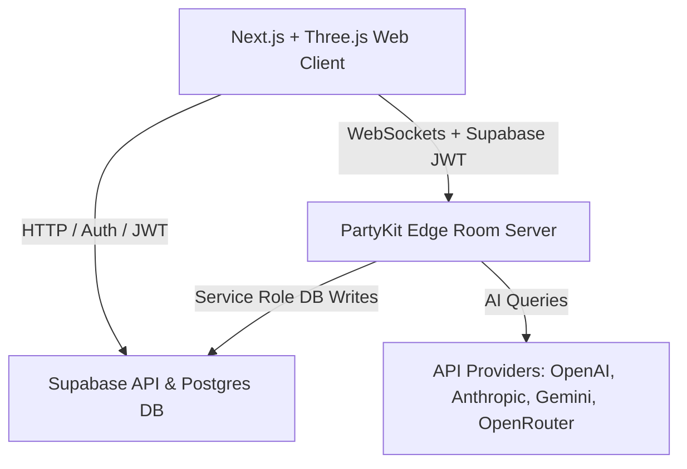

# FOROOMS: Refined Implementation Plan (v1.2.0)

This document outlines the theoretical, algorithmic, and engineering plan to develop **FOROOMS** (Urban Metaverse for Participatory Planning) as a Living Digital Twin web application, incorporating MapLibre transition patterns, tight Supabase/PartyKit auth syncing, and bounded voxel generation limits.

---

## 1. Project Vision & Theoretical Foundations
To elevate FOROOMS as a world-class open-source project that serves as a legitimate tool for global civic planning, we ground the features in established urban and democratic theory:
*   **Communicative Action Theory (Habermas)**: The **Council Layer** serves as an egalitarian discourse space where all viewpoints are structured, not averaged or erased.
*   **Ladder of Citizen Participation (Arnstein)**: User roles map to ascending agency: *Citizen* (view/explore) $\rightarrow$ *Participant* (comment/vote) $\rightarrow$ *Builder* (construct/edit space) $\rightarrow$ *Admin* (configure/moderate). A visible proposal status system prevents "tokenism."
*   **Tactical Urbanism**: The **Playground Layer** allows low-cost, short-term voxel interventions to test ideas rapidly.
*   **Space Syntax (Hillier)**: Space connectivity and sightline analysis are used to calculate the legibility of user-generated designs.

---

## 2. Technical Stack & Deployment Architecture
A split-stack architecture isolates real-time game loops from stateless web application flows:

*   **Frontend (Vercel)**: Next.js + TypeScript + TailwindCSS + React Three Fiber (R3F) + MapLibre GL JS.
    *   **Map vs. 3D Transition**: The 2D MapLibre context (exploration) and the 3D Three.js context (in-Foroom) are technically separated. Moving from 2D to 3D triggers a coordinated CSS crossfade and camera dive to maintain immersion without rendering conflicts.
*   **Multiplayer Server (PartyKit)**: Runs stateful WebSockets at the edge. Authenticates users by verifying the passed Supabase JWT. Writes to Postgres using a secured Supabase Service Role key.
*   **Database & Auth (Supabase)**: Postgres storing profiles, metadata, chat logs, and the append-only block edit ledgers.
*   **AI Providers**: Dynamically dispatched to host-supplied API keys (stored securely in Supabase).

---

## 3. Data Optimization & Voxel State
To maintain a strict "least data" footprint:
1.  **Foroom Base**: Stored as a bounding box and a deterministic OSM snapshot date.
    *   **Scale Limitation**: To prevent memory overflow during generation, a hard bounding-box limit of $2 \times 2$ km is enforced via UI and database checks.
2.  **Edit Log Ledger (`foroom_edits`)**:
    *   Columns: `foroom_id`, `layer` (council/playground/simulation), `user_id`, `action`, `coord` (x,y,z), `value`, `uuid`, `timestamp`.
3.  **Run-Length Encoding (RLE) Binary Format**: Active voxel chunks ($32 \times 32 \times 32$) are serialized as flat `Uint16Array` objects where adjacent pairs represent `[count, blockId]`.
4.  **Networking Payload**: Ephemeral movement updates (20Hz) are broadcast without DB writes. Voxel edits are broadcast immediately and persisted asynchronously by PartyKit.

---

## 4. Geospatial OSM-to-Voxel Pipeline with DEM Terrain
1.  **Coordinate Projection & Elevation Mapping**:
    *   Translate Lat/Lng ($\phi, \lambda$) to Cartesian meters ($x, z$).
    *   **DEM Source**: Mapbox Terrain-RGB tiles are fetched. If unavailable, falls back to a flat plane $y=0$.
        $$y_{terrain} = \lfloor \text{DEM}(\phi, \lambda) \cdot S \rfloor$$
2.  **Rasterization & Extrusion**:
    *   **Base Terrain**: Voxels up to $y_{terrain}$ are solid terrain blocks.
    *   **Roads**: Projected flat on the local terrain elevation surface ($y_{terrain}$) with a $0.25$m extruded sidewalk.
    *   **Buildings**: Footprints are rasterized via raycasting. Buildings extrude starting from the **lowest terrain point** beneath their footprint up to the calculated roof height, preventing floating geometry on sloped hills.

---

## 5. Rendering & Aesthetics
*   **Instanced Rendering**: Group identical voxel types into `THREE.InstancedMesh`.
*   **Greedy Meshing & Face Culling**: Culls interior faces and merges same-texture adjacent faces.
*   **Baked Vertex Ambient Occlusion (AO)**: Calculates corner shadowing accounting for terrain slopes and building edges.
*   **Activity Heatmap (Bloom)**: Active blocks glow based on interaction density via `UnrealBloomPass`.
*   **Custom Avatars & Palettes**: Uses a curated urban color palette (Concrete gray, Blueprint blue, Signal yellow, Park green) applied to procedural spherical-head/polygonal-body avatars.

---

## 6. The Three Layer Realities
*   **Council Layer ($L_{council}$)**: Base twin with terrain. Users place notes/polls inside blocks. Only Builders and Admins can modify voxel geometry. Glowing heatmap highlights high-activity areas.
*   **Playground Layer ($L_{playground}$)**: Collaborative sandbox. Every participant has a block placement quota and receives a uniquely textured block. Space modifications are saved as delta diffs and applied over the sloped terrain.
*   **Simulation Layer ($L_{sim}$)**: Dynamic environment driven by external data (e.g., weather or traffic) and AI Protector actions.

---

## 7. AI Protector & Simulation Governor
*   **Execution Strategy**: The AI Protector runs server-side (as a Supabase Edge Function or Vercel cron). It assumes a "System Builder" identity and writes state changes directly to the `foroom_edits` ledger, rather than mimicking a WebSocket client.
*   **Dynamic Provider Broker**: Supports direct integration with OpenAI, Anthropic, Gemini, and OpenRouter via admin-configured keys.
*   **Deliberative Moderation**: Synthesizes consensus from chat logs and notes using the "Habermas Machine" pattern, generating reports that preserve minority viewpoints.

---

## 8. Verification & Local Testing Plan
### Automated Tests
- **Unit Tests (`lib/osm.test.ts`)**: Verify that the Cartesian projection and elevation offset math match real-world models.
- **RLE Compression (`lib/rle.test.ts`)**: Verify that `[count, blockId]` serialization compresses and deserializes chunks perfectly.

### Manual Verification
- **Multiplayer Synchronicity**: Test movement and Playground block placement between a Citizen client and an Admin client.
- **Floating Foundations**: Render a mock OSM footprint over a steep synthetic elevation grid to ensure building voxel extrusion hits the lowest foundation point.
